## FLEXBOX IN CSS

Flexbox is a one-dimensional layout model that helps you distribute space along a single axis (either horizontally or vertically) in a flexible and efficient way. It allows you to align and distribute elements within a container, making it easier to create complex layouts without using floats or positioning.

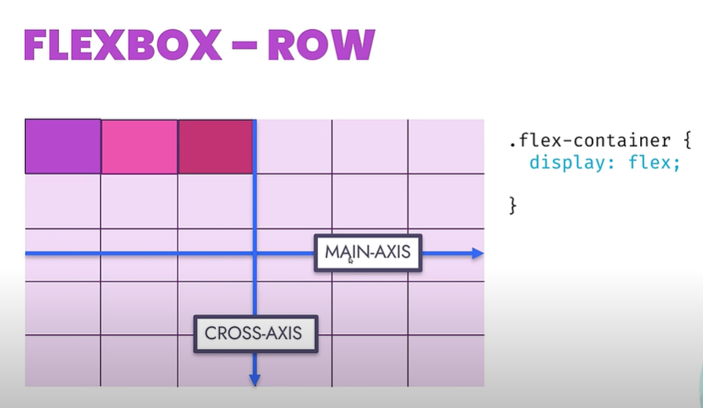

## Flex Container Properties (Parent)

## Flex Container (display: flex;).
To create a flexbox layout, you need a flex container. Apply display: flex; to the container element.
```css
.flex-container {
  display: flex;
}
```
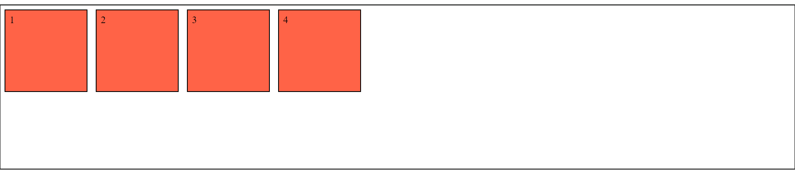

## 2: Flex Items.
Elements inside the flex container are called flex items.

Flex items can be aligned and distributed along the main axis (horizontal or vertical). */

## 3: Main Axis and Cross Axis:
In a flex container, one axis is considered the main axis, and the other is the cross axis. You can set the main axis to be either horizontal (row) or vertical (column).

## Flex Direction (flex-direction): 

Use flex-direction to specify the direction to either main axis or cross-axis.

Values: row, row-reverse, column, column-reverse.
## flex-direction:row:
```css
.flex-container {
  flex-direction: row; //Horizontal main axis (default) 
}
```


## flex-direction:colum:
```css
.flex-container {
  flex-direction: colum;
}
```
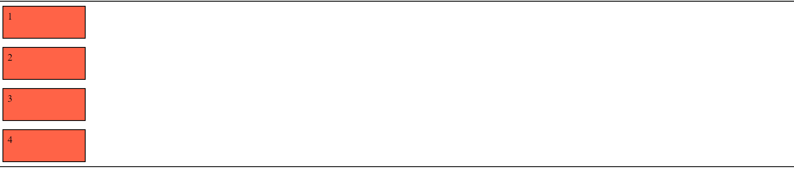

## flex-direction:column-reverse:
```css
.flex-container {
  flex-direction: column-reverse; 
}
```
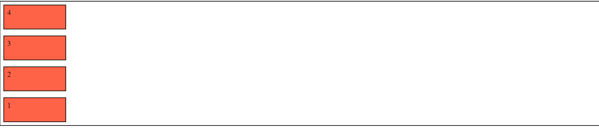

## flex-direction:row-reverse:
```css
.flex-container {
  flex-direction: row-reverse; 
}
```
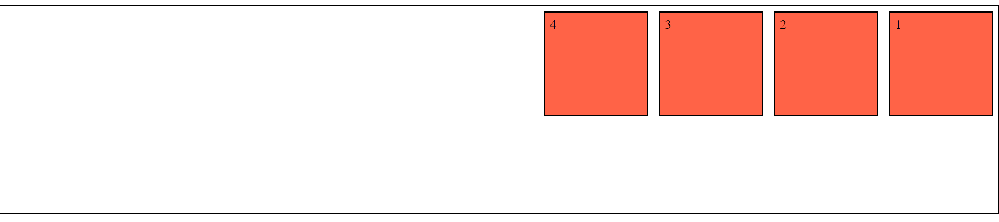


if the flex-direction:row then horizontal will be main-axis 

if flex-direction:column the vertical part will be main-axis and horizontal axis become the cross axis.

when you use flex-direction:column then justify content will work as vertical and align-item will works as horizontal

Items display in a row (the flex-direction property's default is row).

## 4: Justify Content (justify-content).
justify-content aligns flex items along the main axis.

Values include 

- flex-start
- flex-end 
- center
- space-between 
- space-around

## Justify-Content:center;

center: items are centered along the line

```css
.container {
    display: flex;
    height: 400px;
    border: 2px solid black;
    /* justify content property it will horizontal */
    justify-content: center;   
}
```
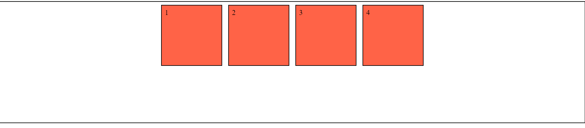

## Justify-Content:flex-start;

flex-start (default): items are packed toward the start of the flex-direction.

```css
.container {
    display: flex;
    height: 400px;
    border: 2px solid black;
    /* justify content property it will horizontal */
    justify-content: flex-start;   
}
```
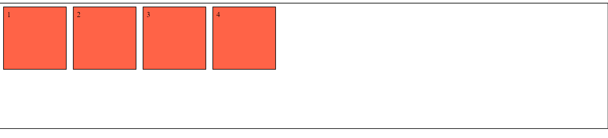

## Justify-Content:flex-end;

flex-end: items are packed toward the end of the flex-direction.

```css
.container {
    display: flex;
    height: 400px;
    border: 2px solid black;
    /* justify content property it will horizontal */
    justify-content: flex-end;   
}
```
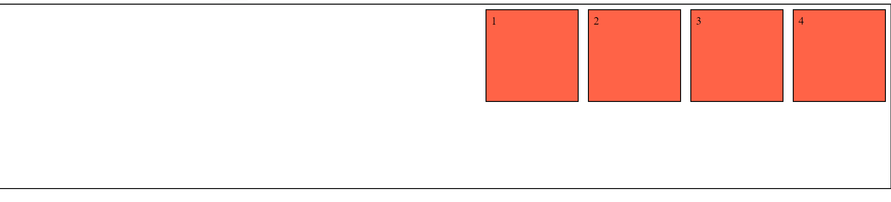

## Justify-Content:space-around;

space-around: items are evenly distributed in the line with equal space around them. Note that visually the spaces aren’t equal, since all the items have equal space on both sides. The first item will have one unit of space against the container edge, but two units of space between the next item because that next item has its own spacing that applies.


```css
.container {
    display: flex;
    height: 400px;
    border: 2px solid black;
    /* justify content property it will horizontal */
    justify-content: space-around;   
}
```
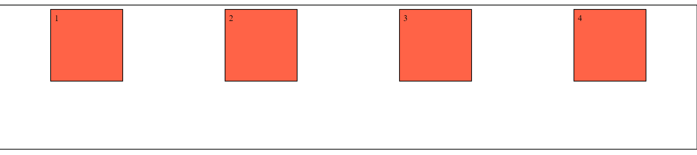

## Justify-Content:space-between;

space-between: items are evenly distributed in the line; first item is on the start line, last item on the end line

```css
.container {
    display: flex;
    height: 400px;
    border: 2px solid black;
    /* justify content property it will horizontal */
    justify-content: space-between;   
}
```
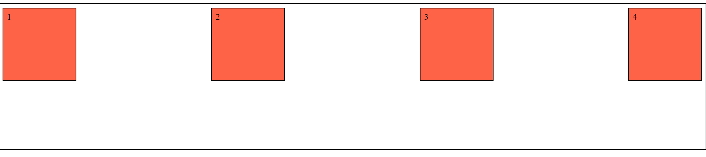

## Justify-Content:space-evenly;
space-evenly: items are distributed so that the spacing between any two items (and the space to the edges) is equal.

```css
.container {
    display: flex;
    height: 400px;
    border: 2px solid black;
    /* justify content property it will horizontal */
    justify-content: space-evenly;   
}
```
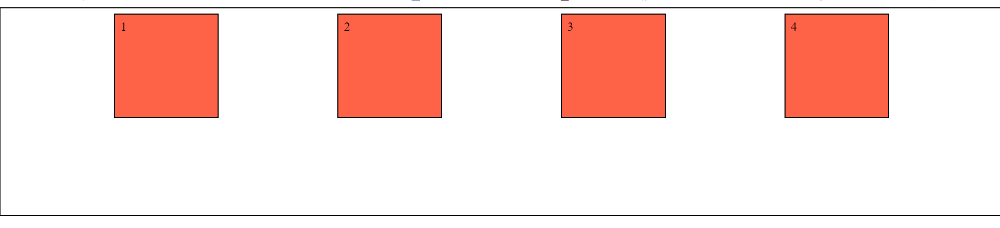


## 5: Align Items (align-items).
align-items aligns flex items along the cross axis.
Values include 

- flex-start
- flex-end 
- center 
- stretch
- baseline

## align-items: center;

```css
.container {
    display: flex;
    height: 400px;
    border: 2px solid black;
    /* justify content property it will horizontal */
    align-items: center;   
}
```
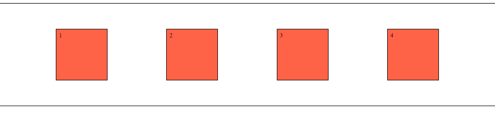

## align-items: flex-start;

```css
.container {
    display: flex;
    height: 400px;
    border: 2px solid black;
    /* justify content property it will horizontal */
    align-items: flex-start;   
}
```
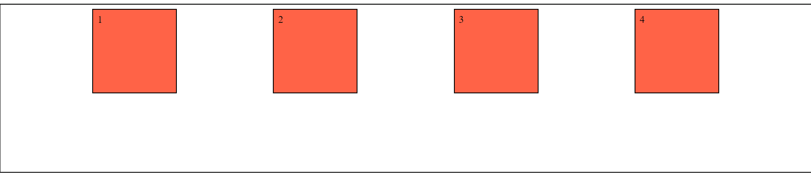


## align-items: flex-end;

```css
.container {
    display: flex;
    height: 400px;
    border: 2px solid black;
    /* justify content property it will horizontal */
    align-items: flex-end;   
}
```
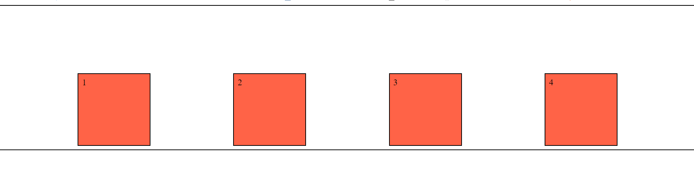

## align-items:stretch;

```css
.container {
    display: flex;
    height: 400px;
    border: 2px solid black;
    /* justify content property it will horizontal */
    align-items:stretch;   
}
```


## 6: flex-wrap:
- Specifies whether flex items should wrap to the next line when they overflow the container.
Values: 

- nowrap (default)
- wrap 
- wrap-reverse
## flex-wrap:wrap;

```css
.container {
    display: flex;
    height: 400px;
    border: 2px solid black;
    /* justify content property it will horizontal */
    flex-wrap:wrap;  
}
```
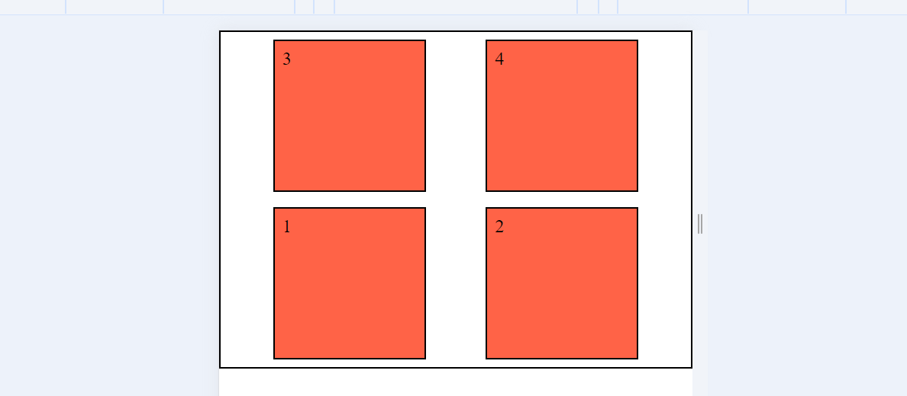

## flex-wrap:wrap-reverse;

```css
.container {
    display: flex;
    height: 400px;
    border: 2px solid black;
    /* justify content property it will horizontal */
    flex-wrap:wrap-reverse;  
}
```
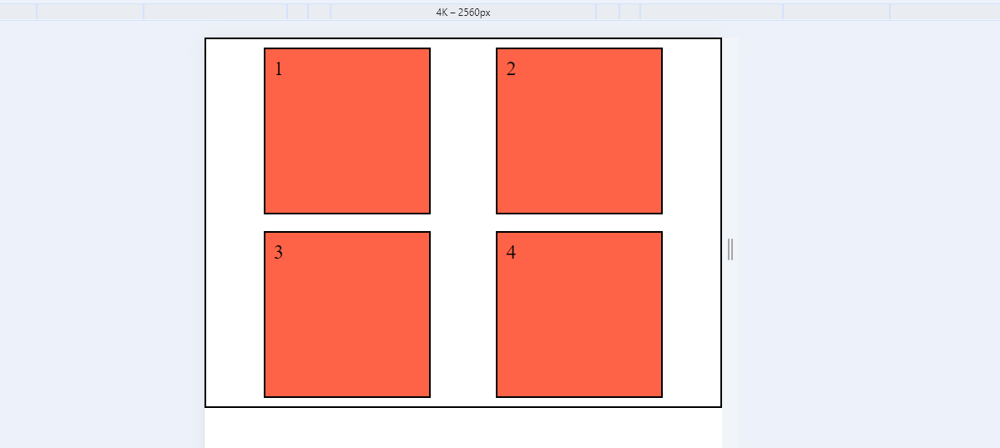

## flex-wrap:nowrap;

```css
.container {
    display: flex;
    height: 400px;
    border: 2px solid black;
    /* justify content property it will horizontal */
    flex-wrap:nowrap;  
}
```
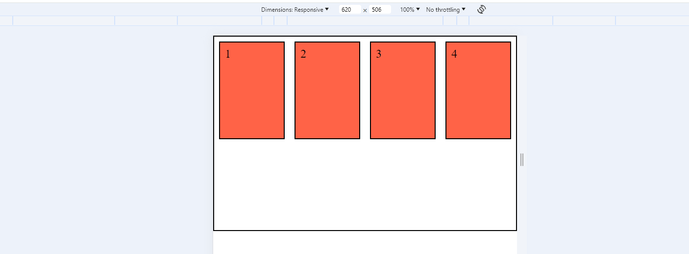


## flex-flow
This is a shorthand for the flex-direction and flex-wrap properties, which together define the flex container’s main and cross axes. The default value is row nowrap.
```css
.container {
  flex-flow: column wrap;
}
```
## 7. gap 
The gap property explicitly controls the space between flex items. It applies that spacing only between items not on the outer edges.
```css
.container {
  display: flex;
  ...
  gap: 10px;
  gap: 10px 20px; /* row-gap column gap */
  row-gap: 10px;
  column-gap: 20px;
}
```


## 7: align-content:
Aligns multiple lines of flex items when there is extra space along the cross axis.
Values: 
- flex-start
- flex-end 
- center
- space-between
- space-around 
- stretch

```css
.container {
  align-content: flex-start | flex-end | center | space-between | space-around | space-evenly | stretch | start | end | baseline | first baseline | last baseline + ... safe | unsafe;
}
```

Note: This property only takes effect on multi-line flexible containers, where flex-wrap is set to either wrap or wrap-reverse. A single-line flexible container (i.e. where flex-wrap is set to its default value, no-wrap) will not reflect align-content.


## FlexBox Item Properties:

## order:
Determines the order in which a flex item appears relative to other flex items within the container.

Lower values come first.

```css
.item1 {
    order: 9;
}
```
Before order 
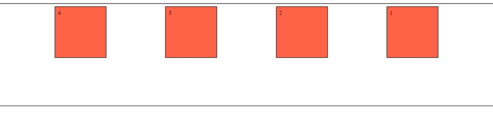

After order property used in item.


## flex-grow:
Specifies how much a flex item should grow to fill available space along the main axis.

Default value is 0, meaning it won't grow.

```css
.item1 {
    flex-grow: 2;
}
```
 
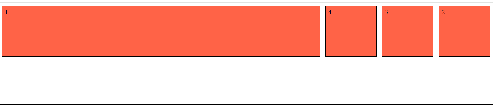


## flex-shrink:
Specifies how much a flex item should shrink when there isn't enough space along the main axis.

Default value is 1, meaning it will shrink.

Negative numbers are invalid.


```css
.item1 {
    flex-shrink: 2;
}
```
 

## flex-basis:
- Defines the initial size of a flex item along the main axis.
- Default value is auto, which means the item's size is determined by its content. */

```css
.item1 {
    flex-basis: 20px;
}
```
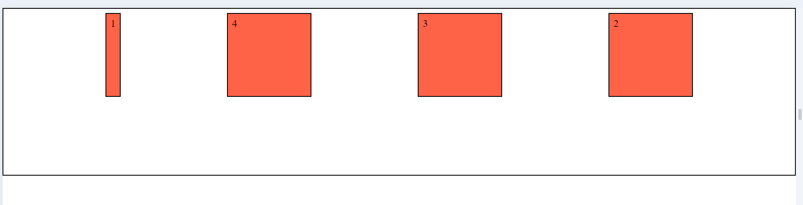

## flex (Shorthand for flex-grow, flex-shrink, and flex-basis):

Combines the three flex item properties in one declaration.

```css
.item1 {
    flex: 2 2 2;
}
```

## Alignment Properties (Self)

## align-self:
Overrides the align-items property for an individual flex item.

Allows you to align a single item differently from others.

This allows the default alignment (or the one specified by align-items) to be overridden for individual flex items.

```css
.item {
  align-self: auto | flex-start | flex-end | center | baseline | stretch;
}
```

## overall source code

```html
<!DOCTYPE html>
<html lang="en">

<head>
    <meta charset="UTF-8">
    <meta name="viewport" content="width=device-width, initial-scale=1.0">
    <title>FlexBox</title>
    <style>
        * {
            margin: 0;
            padding: 0;
            box-sizing: border-box;
        }

        .container {
            display: flex;
            min-height: 400px;
            border: 2px solid black;
            /* flex direction */
            flex-direction: row;
            flex-direction: column;
            flex-direction: column-reverse;
            flex-direction: row-reverse;

            /* justify content property it will horizontal */
            justify-content: center;
            justify-content: flex-start;
            justify-content: flex-end;
            justify-content: space-around;
            justify-content: space-between;
            justify-content: space-evenly;

            /* align-item property it will be vertical */
            align-items: center;
            align-items: flex-start;
            align-items: flex-end;
            align-items: stretch;
            align-items: baseline;

            /* flex wrap */
            flex-wrap: wrap;
            flex-wrap: wrap-reverse;
            flex-wrap: nowrap;

            /* align content */
            align-content: center;
            align-content: flex-start;
            align-content: end;
            align-content: flex-end;
            align-content: space-around;
            align-content: space-between;
            align-content: space-evenly;
        }

        .fitem {
            background-color: tomato;
            border: 2px solid rgb(0, 0, 0);
            margin: 10px;
            padding: 10px;
            font-size: 24px;
            width: 200px;
            height: 200px;
        }

        .item1 {
            order: 9;
            /* flex-grow: 2; */
            /* flex-shrink: 3; */
            /* flex basis work like width it will override the width */
            flex-basis: 20px;

            /* align-self property here */
            align-self: flex-start;
            align-self: center;
        }
    </style>
</head>

<body>
    <span class="container">
        <div class="fitem item1">1</div>
        <div class="fitem item2">2</div>
        <div class="fitem item3">3</div>
        <div class="fitem item4">4</div>
    </span>
</body>

</html>
```

